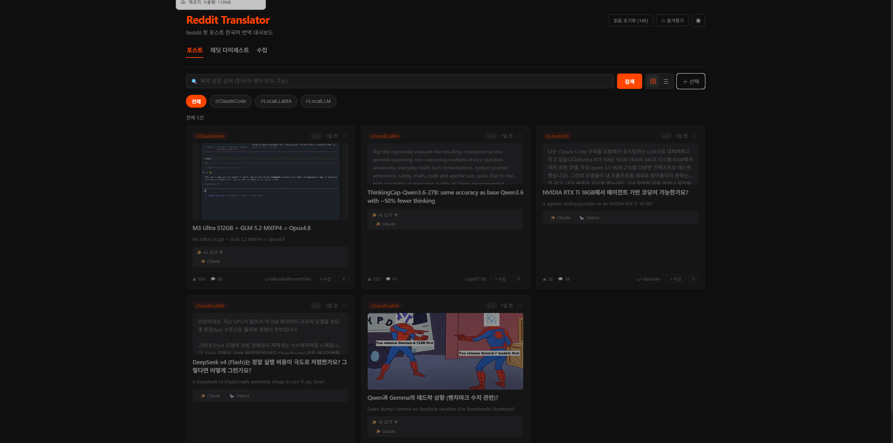

# 남청우 | Backend Developer

Java·Spring 백엔드를 중심으로 데이터 수집, LLM 분석, 배치 운영을 연결하는 개발자 남청우입니다. 새로운 AI 도구를 직접 써보고 개발과 학습에 적용하는 걸 좋아합니다.

[웹 포트폴리오](https://malgcheong.github.io/portfolio/) · [GitHub](https://github.com/malgcheong) · [기술 블로그](https://malgcheong.github.io)

## 대표 프로젝트

## 01. Reddit Translator

**개인 프로젝트 · 설계·개발·운영** · Spring Boot · React · FastAPI · PostgreSQL · LLM API

읽고 싶은 AI 소식을 모으는 데서, 검토한 글을 발행하는 데까지.

### 문제

영문 게시글과 댓글을 매번 찾아 읽고 번역하는 과정을 줄이고, 읽은 자료를 다시 활용할 수 있는 개인 도구가 필요했습니다.

### 담당 역할

수집·번역·요약 엔진, 웹 UI, 데이터 저장, 다이제스트 편집 및 블로그 발행 흐름을 직접 설계·개발했습니다.

### 설계와 구현

**런타임의 역할 분리** — 웹·도메인 기능은 Spring Boot, 수집·LLM 처리는 FastAPI로 나누고 HTTP로 연결했습니다. 공유 DB에서도 수집 테이블과 요약 캐시의 관리 주체를 구분했습니다.

**반복 호출과 실패 비용 줄이기** — 게시글 ID와 제공자별 요약 캐시를 적용했습니다. 댓글은 15개씩 번역하고, JSON 형식이 깨진 청크만 건별 번역으로 재처리합니다.

**사람의 검토를 포함한 발행** — 다이제스트 편집·미리보기 후 발행하면 Astro 저장소에 Markdown을 작성하고 commit·push합니다. 이후 GitHub Actions가 블로그를 배포합니다.

### 결과

수집 → 번역 → 요약 → 편집 → 발행까지 연결해 개인적으로 사용하고 있습니다. 실제 발행 결과는 기술 블로그에서 확인할 수 있습니다.

### 설계에서 고려한 점

개인용 도구의 규모에 맞춰 수집 작업은 전역 락으로 직렬화했습니다. 자동 수집 스케줄러 대신 사용자가 수집을 요청하고 발행 전에 내용을 검토합니다.

[공개 소스 코드](https://github.com/malgcheong/reddit-translator) · [구조 상세](https://github.com/malgcheong/reddit-translator/blob/main/ARCHITECTURE.md) · [발행 결과](https://malgcheong.github.io)

## 02. LLM 분석 게이트웨이와 수집·분석 파이프라인

**엔소프트웨어 · 업무 프로젝트** · Java · Spring Batch · Quartz · Ollama · MariaDB · ClickHouse · Linux

수집 데이터가 분석 결과로 이어지도록, 모델 실행부터 배치 운영까지 연결했습니다.

### 문제

수집 데이터의 키워드·감정·요약 분석을 배치로 처리하면서 모델 실행 환경, 응답 형식, 중복 실행과 실패 재처리를 함께 관리해야 했습니다.

### 담당 역할

stateless LLM 프록시 서버와 Spring Batch 분석 파이프라인을 단독 설계·개발했습니다. 수집 엔진의 분산 처리와 운영 안정화도 담당했습니다.

### 설계와 구현

**모델 호출과 배치 상태 분리** — 내부 GPU의 Ollama와 외부 AI API를 동적으로 분기하도록 구성했습니다. 분석 유형별 시스템 프롬프트 14종을 파일로 관리하고 Ollama 호출에 JSON Schema 기반 constrained decoding을 적용했습니다.

**실행 환경에 맞춘 모델 구성** — Gemma 4 26B(MoE), gpt-oss 120B 등 모델을 GPU 메모리 조건에 맞춰 선정하고 양자화·Modelfile·num_ctx를 조정했습니다.

**반복 실행 가능한 배치** — 100건 단위 청크와 병렬 디스패치, DB 기반 동적 잡 스케줄링을 구성했습니다. 모드별 실행 락으로 중복 진입을 막고 실패 재처리와 잔존 잡 정리를 적용했습니다.

**다중 워커의 작업 분배** — DB 작업 큐와 FOR UPDATE SKIP LOCKED 기반 작업 선점 구조를 개선했습니다. 트랜잭션 격리수준을 READ_COMMITTED로 조정하고 MariaDB → ClickHouse 적재를 증분 처리로 전환했습니다.

### 결과

로컬 모델 실행부터 분석 배치와 데이터 적재까지 연결하고, 운영 중 실패한 작업을 다시 처리할 수 있는 구조를 마련했습니다.

### 설계에서 고려한 점

구조화 출력은 응답 형식 제어에 사용했습니다. 형식이 맞는 응답도 분석 내용의 정확성을 보장하지 않으므로 응답 검증과 실패 처리 흐름을 함께 구성했습니다.

## 03. 공통 커뮤니티 코어

**엔소프트웨어 · 업무 프로젝트** · Spring MVC · Spring Security · MyBatis · MariaDB · GCS

여러 서비스가 공유하는 회원·인증·파일·세션 기능을 개선했습니다.

### 문제

기존 서비스의 호환성을 유지하면서 보안 저장 방식과 다중 서버 운영 구조를 바꿔야 했습니다.

### 담당 역할

회원·인증·파일·세션 공통 기능 개선과 서비스 연동을 담당했습니다.

### 설계와 구현

**단계적으로 저장 방식 이관** — 비밀번호를 BCrypt 해시로, 이메일을 AES-GCM 암호화와 블라인드 인덱스 방식으로 전환했습니다. 이중쓰기 → 백필 → 전환 → 레거시 제거 순으로 이관 단계를 나눴습니다.

**서버 외부로 상태 이동** — 파일 저장을 GCS로 이전하고 세션을 DB로 외부화해 여러 파드에서 공유하도록 구성했습니다. 서비스 간 세션 쿠키 충돌에도 대응했습니다.

**공통 기능과 서비스 연동** — 사용자 REST API와 DB 마이그레이션을 작성하고, deferred join을 적용해 목록 조회 구조를 개선했습니다. 챌린지 인증·패션 커뮤니티의 공통 기능 연동을 담당했습니다.

### 결과

각 서비스가 공통 회원·인증·파일·세션 기능을 재사용할 수 있는 기반을 마련했습니다.

### 설계에서 고려한 점

한 번에 저장 방식을 교체하기보다 이관 단계를 나눠 기존 데이터와 서비스의 호환성을 확인할 수 있도록 구성했습니다.

## 04. 개인 도구 통합 대시보드

**개인 프로젝트 · 설계·개발·운영** · Java 21 · Spring Boot 3.3 · PostgreSQL · Flyway · Thymeleaf

흩어진 도구와 데이터를 한곳에서 관리하기 위한 Spring Boot 애플리케이션입니다.

### 문제

정적 페이지, Python 스크립트, 별도 앱으로 나뉜 개인 도구의 접근 경로와 실행 프로세스를 함께 관리할 필요가 있었습니다.

### 담당 역할

재무·미디어·구직·식단·학습·세션·커리어의 7개 모듈을 통합하고 데이터 관리와 기동 구성을 담당했습니다.

### 설계와 구현

**단일 앱 안에서 모듈 구분** — 각 기능을 하나의 Spring Boot 앱으로 통합하되 DB 사용 모듈은 PostgreSQL 스키마로 구분했습니다.

**변경 이력의 일원화** — Flyway로 DB 변경을 관리하고, 세션·커리어 문서는 파일 기반으로 유지했습니다. Markdown 수정 내용을 화면에서 읽어 제공하도록 연결했습니다.

**반복 가능한 기동** — NSSM 서비스에 PostgreSQL 의존성을 설정해 재부팅 후 자동 기동하도록 구성하고 개인 접근 경로를 마련했습니다.

### 결과

개인 도구의 접근·운영 경로를 통합하고, 문서 수정과 화면의 경력 정보가 이어지도록 구성했습니다.

### 설계에서 고려한 점

개인 운영 규모를 고려해 단일 애플리케이션을 선택했습니다. 개인 데이터를 포함한 서비스이므로 구현 경험을 설명하는 사례로 소개합니다.

## 개발 방식

WSL·tmux 환경에서 여러 AI 에이전트를 병렬로 활용해 왔으며 최근에는 Orca를 사용하고 있습니다. Reddit 자료 수집·요약 서비스와 The Rundown AI 뉴스레터로 동향을 살펴보고, 배운 내용을 개인 프로젝트에 적용합니다.

## 경력 요약

- 엔소프트웨어: 수집·분석 플랫폼, LLM 분석 배치, 공통 커뮤니티 코어 개발.

- KATRI시험연구원: LIMS 유지보수 및 네트워크 관련 업무.

- 토탈소프트뱅크: 터미널 웹 애플리케이션, SOAP·REST 연동, 외부 API 수집 및 DB 갱신 스케줄러 개발.

업무 프로젝트는 담당 역할과 설계 경험을 요약했습니다. 회사 소스 코드·내부 시스템 주소·운영 데이터는 포함하지 않습니다.

## 이 포트폴리오 실행

정적 HTML/CSS로 구성되어 빌드 도구 없이 열 수 있습니다. 로컬 확인: `python3 -m http.server 8000` 실행 후 `http://localhost:8000`.
